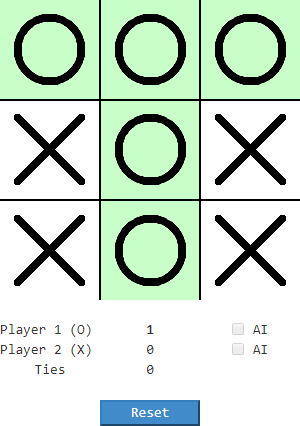
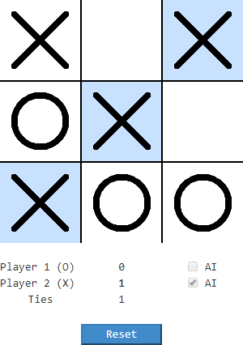
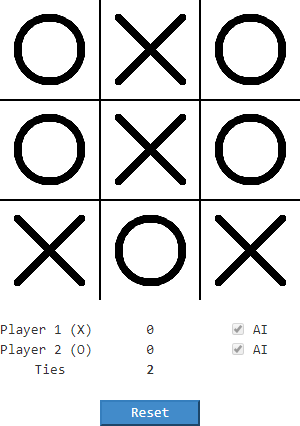

# Tic Tac Toe

A classic game of Tic Tac Toe, with a custom built AI engine.

To play, select a team (swap by clicking on the X / O icons) and a player type (swap by clicking the AI checkboxes).  If Player 1 is not an AI, simply click on any grid square to make your first move.  Otherwise, click the "Start" button to initiate the game.  New games will begin automatically after the previous game ends.  Clicking the "Reset" button will clear all progress and set the application back to its initial state.

The [AI engine](TicTacToe/Models/Ai/AiEngine.cs) is an original work, and is entirely rule-based; positions are not hardcoded.  The algorithm prioritizes loss avoidance and variety of playable moves, with a secondary objective to seek wins in an opportunistic manner.

Please note that this application is not currently hosted, however the full repo can be reassembled and will function with localhost.

/////////////////////////////////////////////////  
//////////////// <b>Screenshot 1</b> ////////////////  
////////////////////////////////////////////////  

/////////////////////////////////////////////////  
//////////////// <b>Screenshot 2</b> ////////////////  
////////////////////////////////////////////////  

/////////////////////////////////////////////////  
//////////////// <b>Screenshot 3</b> ////////////////  
////////////////////////////////////////////////  

